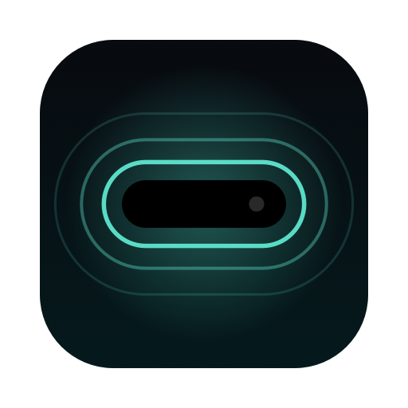

<p align="center">
  
</p>

<h1 align="center">Halo</h1>

<p align="center">A free, open source Dynamic Island for the MacBook notch.</p>

Halo lives around the notch. Hover over it and it expands into a hub for media controls, a file shelf, custom volume and brightness HUDs, system stats, a calendar, and timers.

<!-- Screenshots: collapsed notch, expanded media card, shelf with files,
     HUD wings mid-volume-change, calendar page, pomodoro ring.
     Drop images into docs/ and reference them here. -->

## Features

- Notch overlay that expands on hover or click, with a configurable hover delay and smooth spring animations
- Now Playing: album art, track info, play, pause, skip, seek by dragging the progress bar, an animated equalizer, and a like button for players that report like support. Works with Apple Music, Spotify, and media playing in a browser tab. The card background is built from the current album art
- Music in the wings: mini artwork and a small equalizer beside the notch while music plays
- File shelf: drag files onto the notch to hold them, drag them back out into any app, send them via AirDrop, and pin the ones you want to keep across restarts. Select several tiles and drag them out as one group
- Shelf quick actions: compress files or folders to zip, convert images to PNG or JPEG, and rename, all from the right click menu. Results land back on the shelf
- New screenshots land on the shelf automatically, wherever your screenshot folder lives
- Clipboard history page with search, click to copy, and pins. Off by default. History stays in memory and dies with the app; only pinned entries persist. Entries marked concealed or transient, the convention password managers use, are never captured
- Custom volume and brightness HUDs that replace the system pop ups, including monitor speaker volume over DDC for DisplayPort and HDMI audio, which macOS itself cannot control
- Control sliders card: volume, built in display brightness, external monitor brightness over DDC, and keyboard backlight, all by mouse, plus a picker that switches the audio output device, a keep awake toggle, and a Focus toggle that runs your Halo Focus shortcut
- Scroll over the collapsed notch to change volume, swipe sideways to skip tracks, pinch to open and close the panel
- Several live activities at once: running timers and music share the wings, most urgent first
- System stats: CPU, GPU, RAM and network readouts, and a two line battery section with health and cycle count, time to full while charging, connected accessory batteries, a green charging flash in the notch, and a red flash when the battery sinks through 20 and 10 percent
- Calendar page with a month grid and per day events, quick timers with a completion ring, and a full Pomodoro timer with configurable rounds. Running timers stay visible in the collapsed notch
- Settings window: every feature has an on and off toggle, plus accent color and tint themes, global keyboard shortcuts that open any page from anywhere, launch at login, and a live view of permissions
- A short welcome tour on first launch

## Install (no Xcode needed)

With Homebrew:

```sh
brew install --cask spador/halo/halo
xattr -dr com.apple.quarantine /Applications/Halo.app
```

The second line clears the download quarantine. It is needed because this is a personal build that is not notarized by Apple.

To stay on the version 1 line, which makes zero network connections of any kind, install the pinned cask instead:

```sh
brew install --cask spador/halo/halo@1
xattr -dr com.apple.quarantine /Applications/Halo.app
```

Both casks install the same Halo.app, so only one can be installed at a time. To switch, uninstall one and install the other:

```sh
brew uninstall --cask halo
brew install --cask spador/halo/halo@1
```

To update to the newest release later, run `brew upgrade --cask halo` and clear the quarantine again with the same xattr command.

Manual: download the zip from [Releases](https://github.com/Spador/Halo/releases), unzip, drag Halo.app into Applications, and run the same xattr command.

On first launch, grant Accessibility when asked. That powers the volume and brightness HUD replacement. Calendar access is only requested if you open the calendar page and click Connect Calendar. Everything else works with no permissions at all: global shortcuts, sliders, the output picker, gestures, and scroll volume all use permission free system APIs.

## Principles

- Native and minimal. Swift 6 and SwiftUI, with AppKit where the overlay needs it. No web views.
- Apple frameworks only, with one audited, vendored exception for Now Playing data (see `Vendor/README.md`).
- Lightweight. Idle CPU is 0.0 percent and memory stays around 25 MB in practice. Updates are event driven, not polled.
- Private by design. No telemetry, no crash reporters, no network calls. Permissions are requested only when a feature needs them.

## Privacy and permissions

Halo makes zero network connections. Nothing you play, hold, copy, or schedule ever leaves the machine. The only data written to disk lives in the app preferences: pinned shelf file paths, pinned clipboard entries, your settings, and your Pomodoro durations.

The clipboard history feature is off by default. When enabled it checks the pasteboard change counter once per second (macOS offers no notification for this), keeps captured text in memory only, and never captures entries that password managers mark concealed or transient. Clear removes everything except your pins.

| Permission | When asked | Why | Scope |
|---|---|---|---|
| Accessibility | At launch, for the HUD feature | An event tap must intercept volume and brightness keys before macOS shows its own HUD | The tap is filtered to system media key events only. See `MediaKeyTap.swift`. Ordinary keystrokes travel on a different event type and never reach Halo |
| Calendar (full access) | Only when you click Connect Calendar | To show your events in the notch | Read only usage. Declining just leaves the calendar page empty |

Halo uses three private or undocumented API surfaces, listed in the open. Each fails gracefully if a macOS update breaks it:

- MediaRemote, through the vendored [mediaremote-adapter](Vendor/README.md), for system wide Now Playing info. Apple locked the direct route in macOS 15.4
- DisplayServices, for setting the built in display brightness. No public API exists for this
- IOAVService (DDC/CI), a standard control channel to external monitors, used for speaker volume and brightness
- CoreBrightness (KeyboardBrightnessClient), for the keyboard backlight slider. No public API exists; the control otherwise lives only in Control Center

The app is not sandboxed. Spawning the media helper and the interfaces above require that. It requests no unusual entitlements.

## Known limitations

- Brightness keys cannot be intercepted on current macOS builds: the system consumes them before any event tap, at any level, sees them (verified by logging every event reaching the tap). Built in display brightness keys therefore show the stock macOS pop up, not Halo's. Volume keys are unaffected
- External monitor brightness works through the slider on the controls card, over DDC. Capability is verified per monitor at discovery: Halo nudges the level by one percent, reads it back, and restores it, retrying if the monitor's DDC bus is busy. Some monitors block DDC brightness while an energy saving or auto brightness mode is active in their own menu
- The HUD feature needs the Accessibility permission. Quit Halo and your keys instantly revert to stock macOS behavior

## Requirements

- A Mac with a notch (MacBook Air 2022 or later, MacBook Pro 14 or 16 inch 2021 or later)
- macOS 14 Sonoma or later
- Xcode 16 or later, only if building from source

## Build from source

1. Clone the repo and open `Halo.xcodeproj` in Xcode.
2. In Signing & Capabilities, select your own team. A free personal Apple ID team works and keeps permission grants stable across rebuilds.
3. Press Cmd R to build and run. Nothing but Xcode is required. The one vendored dependency compiles from source during the build.

For daily use, build a Release copy into Applications:

```sh
xcodebuild -project Halo.xcodeproj -scheme Halo -configuration Release build
cp -R ~/Library/Developer/Xcode/DerivedData/Halo-*/Build/Products/Release/Halo.app /Applications/
```

## License

MIT for Halo code (see `LICENSE`). The vendored mediaremote-adapter remains under its BSD 3-Clause license (see `Vendor/`).
